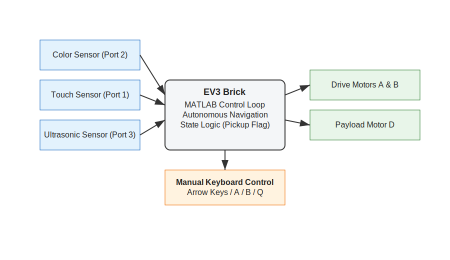

# Project Spyn: Autonomous LEGO EV3 Maze Navigator

An intelligent autonomous robotic car built with LEGO EV3 kit and programmed in MATLAB to navigate complex mazes while safely transporting a cardboard wheelchair-bound passenger from pickup to drop-off locations.

## Overview
Developed as part of FSE coursework at Arizona State University, this project demonstrates sensor fusion, autonomous navigation algorithms, and state-based control systems using MATLAB's EV3 robotics interface.

## Key Features

### 🤖 Multi-Sensor Navigation System
The robot continuously reads data from three sensors:
- **Color Sensor (Port 2)**: Color-coded waypoint detection for autonomous decision-making
- **Ultrasonic Sensor (Port 3)**: Distance-based wall detection with 50-unit threshold for gap navigation
- **Touch Sensor (Port 1)**: Collision detection and intelligent recovery system

Sensor readings are processed using rule-based logic to determine motor actions in real time.

### 🧭 Autonomous Navigation Algorithms
- **Forward Motion**: Continuous forward movement using motors A and B
- **Gap Detection**: When ultrasonic distance exceeds a defined threshold (50 units), the robot executes a timed turn to navigate openings
- **Threshold-Based Turning**: Right-side distance measurements determine when to initiate turns
- **Collision Recovery**: Robot stops upon collision; Backs up for a fixed duration; Chooses left or right turn based on ultrasonic distance.

All navigation behavior is implemented using empirically tuned motor speeds and time-based motion control.

### 🎨 Color-Coded Waypoint System
- **Red Markers**: Automatic 1-second stop (traffic control simulation)
- **Green Markers**: Pickup location - triggers manual keyboard control mode
- **Blue Markers**: Drop-off location - activates only after pickup completion (state-based logic)

### 🎮 Manual Keyboard Control Mode
Seamlessly switches between autonomous and manual control:
- **Arrow Keys**: Forward/backward/left/right navigation
- **A/B Keys**: Payload mechanism control (motor D at ±10 power)
- **Q Key**: Exit manual mode, resume autonomous navigation

### 🔧 Technical Implementation - Hardware
- **Platform**: LEGO Mindstorms EV3
- **Motors Used**:
- Motor A — Left drive wheel
- Motor B — Right drive wheel
- Motor D — Payload pickup/drop mechanism
- **Sensors**:
- Color sensor
- Ultrasonic distance sensor
- Touch sensor

### 🔧 Technical Implementation - Software
- **Language**: MATLAB
- **Control Style**:
- Reactive rule-based control
- Time-based movement and turning
- State tracking using flags
- **Connectivity**:
- Bluetooth connection to EV3 brick
- Brick name: JESUS

## Technical Specifications
- **Language**: MATLAB
- **Hardware**: LEGO Mindstorms EV3
- **Sensors**: 3 (Color, Ultrasonic, Touch)
- **Motors**: 4 (A, B for front wheels; D for payload)
- **Control Modes**: Autonomous + Manual Override
- **Navigation**: Threshold-based wall following, collision avoidance

## Performance Highlights
- Autonomous maze navigation with zero human intervention
- Safe passenger transport with pickup/drop-off validation
- Robust collision recovery and obstacle avoidance
- Seamless autonomous-manual mode switching

## Team
- Vaishnavi Lokhande
- Aaleeiah Kinney
- Tracy Nguyen
- John Johnson (JJ)

## Course
FSE 100 - Introduction to Engineering, Arizona State University

---

**Technologies**: MATLAB | LEGO Mindstorms EV3 | Sensor Fusion | Autonomous Systems | State Machines | Real-time Control
